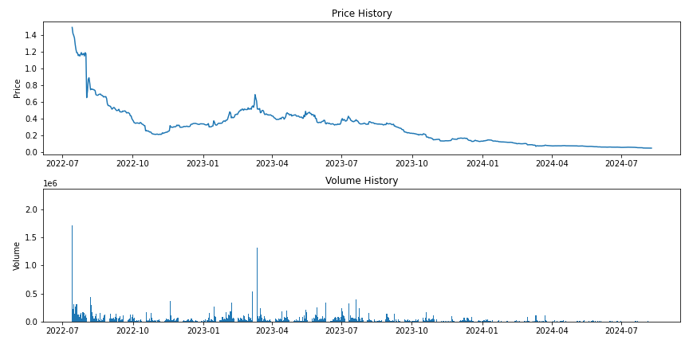

## How to Screen and Clean Raw Token Time Series Data

Most of the time, we receive time series data from a DEX's API, some aggregator source or download it directly from someone else. It is highly unlikely that this data represents the reality of what actually can be achieved in the market at any point in time. From obvious "fat finger" errors like 9.1112 instead of 0.1112 as the token's high price, the opening could be identical to the previous' day's close because the market "never closes" and timezones or trading hours are not established in crypto markets. Also, the low could be achieved by a cascading AMM fill for stop loss orders being triggered where the final order to execute is for a few hundred ADA at a price that is close to zero. Data manipulation or data connectivity problems during the API call could be other sources or wrong or mangled data. Ideally, we want to run a few scripts over our time series to find the most harmful errors that could badly skew our trading strategy analysis, or lead to wrong risk measurements.

We use a simple Python script you can find in this folder [**dataScanner.py**](https://github.com/Sapient-Predictive-Analytics/dataportal/blob/main/tokens/dataScanner.py) to scan data and produce a "quality report". This flags potentially problematic date format, outlier detection using the [IQR method](https://medium.com/@pp1222001/outlier-detection-and-removal-using-the-iqr-method-6fab2954315d) and descriptive statistics. It also reports on the existence of "not a number". The report also has a list at the bottom of the exact dates potential outliers occur, so we can manually check and correct the data in Excel, or run scripts to remedy problems if there are more than a few.

### The Data Quality Analysis Report Program

~~~
import pandas as pd
import numpy as np
from dateutil.parser import parse
import matplotlib.pyplot as plt

def analyze_csv(file_path):
    # Read the CSV file
    df = pd.read_csv(file_path, parse_dates=['date'])

    print("Data Quality Analysis Report")
    print("===========================\n")

    # Print column names
    print("Column Names:")
    print(df.columns.tolist())
    print()

    # Analyze date format
    date_col = df['date']
    date_formats = date_col.apply(lambda x: x.strftime('%Y-%m-%d')).unique()
    print(f"Date Format: {date_formats[0]}")
    print(f"Date Range: {date_col.min()} to {date_col.max()}")
    print()

    # Percentage of NaN values in each column
    print("Percentage of NaN values in each column:")
    nan_percentages = df.isnull().mean() * 100
    for col, percentage in nan_percentages.items():
        print(f"{col}: {percentage:.2f}%")
    print()

    # High and low values for numeric columns
    numeric_cols = df.select_dtypes(include=[np.number]).columns
    print("High and Low values for numeric columns:")
    for col in numeric_cols:
        print(f"{col}:")
        print(f"  High: {df[col].max():.6f}")
        print(f"  Low: {df[col].min():.6f}")
    print()

    # Basic statistics
    print("Basic statistics for numeric columns:")
    print(df.describe())
    print()

    # Check for duplicates
    duplicates = df.duplicated().sum()
    print(f"Number of duplicate rows: {duplicates}")
    print()

    # Check for outliers using IQR method
    print("Potential outliers (using IQR method):")
    outliers_report = {}
    for col in numeric_cols:
        Q1 = df[col].quantile(0.25)
        Q3 = df[col].quantile(0.75)
        IQR = Q3 - Q1
        lower_bound = Q1 - 1.5 * IQR
        upper_bound = Q3 + 1.5 * IQR
        outliers = df[(df[col] < lower_bound) | (df[col] > upper_bound)]
        print(f"{col}: {len(outliers)} potential outliers")
        outliers_report[col] = {'count': len(outliers), 'data': outliers}
    print()

    # Analyze trading volume
    print("Trading Volume Analysis:")
    print(f"Average Daily Volume: {df['volume'].mean():.2f}")
    print(f"Highest Volume Day: {df.loc[df['volume'].idxmax(), 'date']} ({df['volume'].max():.2f})")
    print(f"Lowest Volume Day: {df.loc[df['volume'].idxmin(), 'date']} ({df['volume'].min():.2f})")
    print()

    # Calculate daily returns
    df['daily_return'] = df['close'].pct_change()

    # Calculate volatility (standard deviation of returns)
    volatility = df['daily_return'].std() * np.sqrt(252)  # Annualized volatility
    print(f"Annualized Volatility: {volatility:.2%}")

    # Plot price and volume
    plt.figure(figsize=(12, 6))
    plt.subplot(2, 1, 1)
    plt.plot(df['date'], df['close'])
    plt.title('Price History')
    plt.ylabel('Price')

    plt.subplot(2, 1, 2)
    plt.bar(df['date'], df['volume'])
    plt.title('Volume History')
    plt.ylabel('Volume')

    plt.tight_layout()
    plt.savefig('price_volume_history.png')
    plt.close()

    print("\nA plot of price and volume history has been saved as 'price_volume_history.png'")

    # Detailed outlier report
    print("\nDetailed Outlier Report:")
    for col, data in outliers_report.items():
        print(f"\n{col}:")
        if data['count'] <= 6:
            print("Outlier dates:")
            for _, row in data['data'].iterrows():
                print(f"  {row['date']}: {row[col]:.6f}")
        else:
            # Perform 3 * IQR analysis for columns with more than 6 outliers
            Q1 = df[col].quantile(0.25)
            Q3 = df[col].quantile(0.75)
            IQR = Q3 - Q1
            lower_bound = Q1 - 3 * IQR
            upper_bound = Q3 + 3 * IQR
            extreme_outliers = df[(df[col] < lower_bound) | (df[col] > upper_bound)]
            print(f"Extreme outliers (3 * IQR method):")
            for _, row in extreme_outliers.iterrows():
                print(f"  {row['date']}: {row[col]:.6f}")

# Call the function with our CSV file path
analyze_csv('WRT.csv')
~~~

### The Output of the Report (Example: Wing Rider Token)

## Data Quality Analysis Report

### Column Names

- date
- open
- high
- low
- close
- volume

### Date Information

- **Date Format:** 2022-07-14
- **Date Range:** 2022-07-14 to 2024-08-09

### Percentage of NaN Values

| Column | NaN Percentage |
|--------|----------------|
| date | 0.00% |
| open | 0.00% |
| high | 0.00% |
| low | 0.00% |
| close | 0.00% |
| volume | 0.00% |

### High and Low Values for Numeric Columns

| Column | High | Low |
|--------|------|-----|
| open | 1.489598 | 0.050753 |
| high | 1.834970 | 0.050753 |
| low | 1.394460 | 0.050716 |
| close | 1.489598 | 0.050734 |
| volume | 2242306.788919 | 83.840115 |

### Basic Statistics for Numeric Columns

|       | date                |        open |        high |         low |       close |           volume |
|:------|:--------------------|------------:|------------:|------------:|------------:|-----------------:|
| count | 758                 | 758         | 758         | 758         | 758         |    758           |
| mean  | 2023-07-27 12:00:00 |   0.300665  |   0.305987  |   0.294209  |   0.299318  |  58401.4         |
| min   | 2022-07-14 00:00:00 |   0.0507535 |   0.0507535 |   0.0507161 |   0.0507343 |     83.8401      |
| 25%   | 2023-01-19 06:00:00 |   0.122701  |   0.122729  |   0.121452  |   0.121516  |  11987.2         |
| 50%   | 2023-07-27 12:00:00 |   0.305998  |   0.308991  |   0.302119  |   0.305058  |  27497.7         |
| 75%   | 2024-02-01 18:00:00 |   0.404336  |   0.412074  |   0.395286  |   0.403845  |  63149.5         |
| max   | 2024-08-09 00:00:00 |   1.4896    |   1.83497   |   1.39446   |   1.4896    |      2.24231e+06 |
| std   | nan                 |   0.228743  |   0.237738  |   0.220421  |   0.227199  | 132055           |

### Duplicate Rows

**Number of duplicate rows:** 0

### Potential Outliers (IQR Method)

- **open:** 22 potential outliers
- **high:** 23 potential outliers
- **low:** 21 potential outliers
- **close:** 21 potential outliers
- **volume:** 59 potential outliers

### Trading Volume Analysis

- **Average Daily Volume:** 58401.36
- **Highest Volume Day:** 2022-08-02 (2242306.79)
- **Lowest Volume Day:** 2024-07-15 (83.84)

### Volatility

**Annualized Volatility:** 58.77%

### Detailed Outlier Report

#### open

**Extreme outliers (3 * IQR method):**

| Date | Value |
|------|-------|

| 2022-07-15 | 1.489598 |

| 2022-07-16 | 1.417721 |

| 2022-07-17 | 1.393708 |

| 2022-07-18 | 1.363342 |

| 2022-07-19 | 1.284046 |

#### high

**Extreme outliers (3 * IQR method):**

| Date | Value |
|------|-------|

| 2022-07-14 | 1.834970 |

| 2022-07-15 | 1.489598 |

| 2022-07-16 | 1.485451 |

| 2022-07-17 | 1.401535 |

| 2022-07-18 | 1.369497 |

| 2022-07-19 | 1.287530 |

#### low

**Extreme outliers (3 * IQR method):**

| Date | Value |
|------|-------|

| 2022-07-15 | 1.394460 |

| 2022-07-16 | 1.393707 |

| 2022-07-17 | 1.357308 |

| 2022-07-18 | 1.267492 |

#### close

**Extreme outliers (3 * IQR method):**

| Date | Value |
|------|-------|

| 2022-07-14 | 1.489598 |

| 2022-07-15 | 1.417721 |

| 2022-07-16 | 1.393708 |

| 2022-07-17 | 1.363342 |

| 2022-07-18 | 1.284046 |

#### volume

**Extreme outliers (3 * IQR method):**

| Date | Value |
|------|-------|

| 2022-07-14 | 1710444.909539 |

| 2022-07-15 | 230131.956095 |

| 2022-07-16 | 318244.557675 |

| 2022-07-18 | 276674.505929 |

| 2022-07-19 | 309142.855962 |

| 2022-07-20 | 309897.647501 |

| 2022-08-02 | 2242306.788919 |

| 2022-08-03 | 348952.452614 |

| 2022-08-04 | 538998.746054 |

| 2022-08-05 | 471780.682193 |

| 2022-08-06 | 267063.317610 |

| 2022-08-07 | 447451.557337 |

| 2022-08-08 | 296590.621448 |

| 2022-08-29 | 321378.673497 |

| 2022-10-18 | 502497.222794 |

| 2022-11-19 | 369904.856623 |

| 2023-01-15 | 277680.490664 |

| 2023-02-07 | 341334.072291 |

| 2023-03-06 | 540165.936507 |

| 2023-03-07 | 246730.293446 |

| 2023-03-10 | 728016.096256 |

| 2023-03-11 | 264064.254538 |

| 2023-03-13 | 1318562.081617 |

| 2023-03-17 | 240910.668753 |

| 2023-05-15 | 217538.908200 |

| 2023-05-30 | 251309.882424 |

| 2023-06-10 | 335716.766235 |

| 2023-07-01 | 245662.267588 |

| 2023-07-09 | 236956.319829 |

| 2023-07-11 | 333531.334721 |

| 2023-07-20 | 390996.644612 |

| 2023-07-24 | 242518.437323 |

### Data Cleaning Remedies
